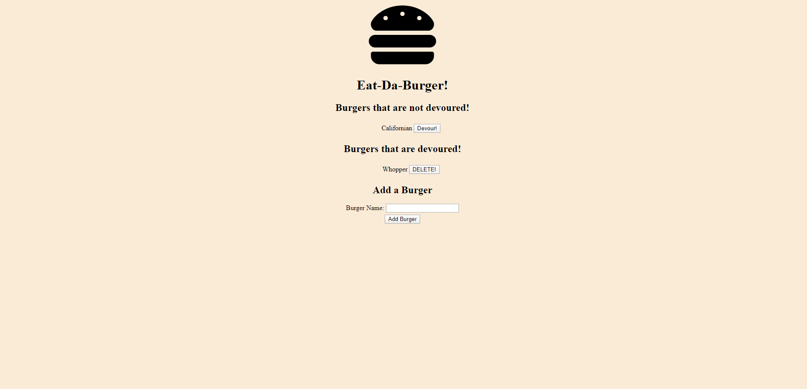

# Burger

## Description

This program allows you to add burgers to a list to be devoured and then you are able to delete them once they are devoured.

## Screenshot of Program


## Installing Packages

```
npm i || npm install
```

## How to run the Program Locally

```
npm run start || node server.js
```

## Link to Live

https://devour-your-burger.herokuapp.com/

## Langauges Used

* Handlebars
* Express
* Javascript
* CSS
* HTML
* MySQL

## Contributing
Pull requests are welcome. For major changes, please open an issue first to discuss what you would like to change.
Please make sure to update tests as appropriate.

## License
No License required. These are public pages.